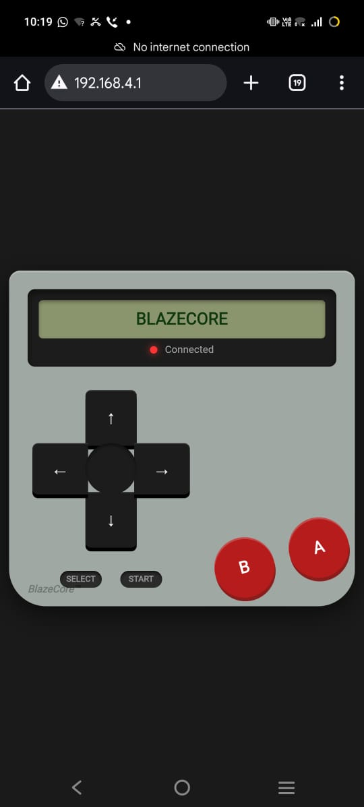
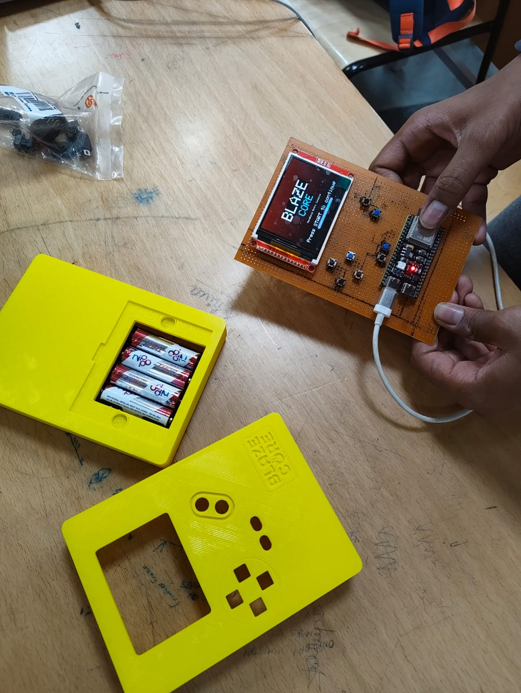
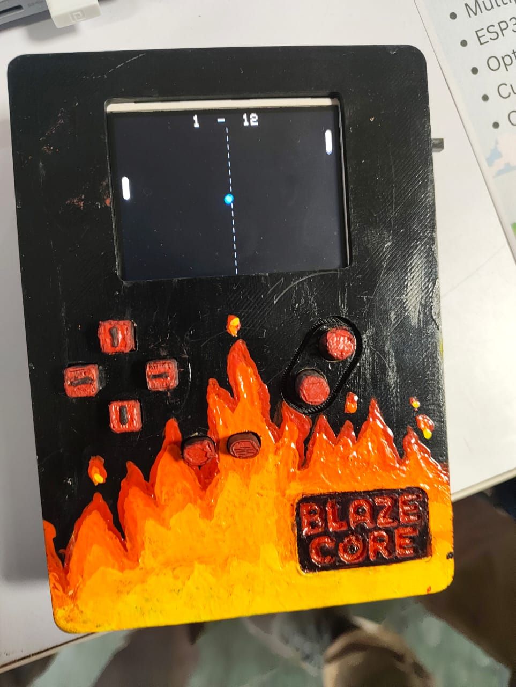

# 🎮 ESP32 Standalone Multiplayer Game Console

**A custom-engineered, 3D-printed local multiplayer gaming console powered by an ESP32 microcontroller.**

This project is a fully functional, standalone hardware and software gaming system developed as part of academic coursework (under the mentorship of Prof. Sunil Jha). It features custom server-client architecture for local multiplayer gaming, housed in a bespoke, 3D-printed enclosure.

## 🚀 Key Features

* **Microcontroller Architecture:** Built on the ESP32 platform, utilizing its integrated Wi-Fi and AsyncTCP/ESPAsyncWebServer libraries to handle local web gamepad integration.
* **Local Multiplayer System:** Employs a custom server-client network architecture that allows multiple devices/players to connect and interact locally without external internet dependency via WebSockets (`/ws`).
* **Dual Control Mode:** Supports both integrated physical tactile buttons and remote web-based gamepads (BlazeCore Webpad) mapped via custom state machines.
* **CAD & 3D Fabrication:** The protective enclosure was custom-designed using Autodesk Fusion 360 and fabricated via FDM 3D printing, featuring tailored cutouts for tactile inputs and battery integration.
* **Hardware Integration:** Integrates distinct electronic modules including a TFT LCD display, tactile push buttons (Micro-switches), and an active buzzer/LED layout to deliver an arcade-like standalone experience.

## 🛠️ Tech Stack & Components

* **Microcontroller:** ESP32 development board (ESP-WROOM)
* **Display:** TFT LCD Screen (via `TFT_eSPI.h`)
* **Input Peripherals:** Tactile push buttons (Micro-switches)
* **Power Source:** Battery module / AA Battery holder
* **Networking & Web Server:** WiFi, AsyncTCP, ESPAsyncWebServer, ArduinoJson
* **Programming Language:** C / C++ (Arduino IDE / PlatformIO)
* **Design Software:** Autodesk Fusion 360
* **Fabrication Method:** FDM 3D Printing

## 📷 Hardware & Visual Assets

| Web Gamepad UI | Bare Board Assembly | Final Enclosure (Blaze Core) |
| :---: | :---: | :---: |
|  |  |  |

* **Official Project Exhibition Video:** [Watch the Blaze Core Exhibition & Gameplay Demo on YouTube](https://www.youtube.com/watch?v=ppUA_ruJNzk)
* **Gameplay Operations:** Standalone local multiplayer server-client operations supporting 12 retro game modes (Snake, Pong, Flappy Bird, Geometry, Pac-man, Tetris, Multiplayer variants, and Casino games).

## ⚙️ Installation & Setup

### Option A: Flash the Microcontroller
1. **Clone or download the C++ sketch:** Ensure your source files or `main.cpp` are opened in the Arduino IDE or PlatformIO.
2. **Board Definitions:** Ensure the ESP32 board packages are installed and rotation settings are aligned to landscape/rotation 3.
3. **GPIO Pinout Map:** The hardware pins are hardcoded as follows:
   * `BTN_A`: GPIO 4
   * `BTN_B`: GPIO 5
   * `BTN_SELECT`: GPIO 8
   * `BTN_DOWN`: GPIO 46
   * `BTN_RIGHT`: GPIO 10
   * `BTN_UP`: GPIO 16
   * `BTN_LEFT`: GPIO 21
   * `BTN_START`: GPIO 6
4. Connect your ESP32 dev board via USB, compile, and flash the code directly onto the board.

### Option B: Local Network & Web Gamepad Setup
1. Optionally, configure your existing Wi-Fi credentials directly inside the code (WLAN station mode).
2. If no station connection is established, the device automatically falls back to an Access Point (AP) mode broadcasting `BLAZECORE-XXXX` (with password `blaze1234`).
3. Connect any smartphone or secondary device to the network, navigate to the local IP address (or Access Point IP), and interact with the graphical Webpad interface.

## 🖥️ Usage

1. Power on the console via the integrated battery module.
2. Navigate the boot splash screen and main game selection menu using physical tactile push buttons (Edge-detected inputs prevent repeat triggers).
3. Select any game (e.g., *Snake*, *Pong*, *Tetris*, *Pac-Man*) using the "A" button to launch.
4. For local multiplayer titles, alternate between physical controllers (P1) and the WebSocket BlazeCore Webpad (P2). 
5. Press the "SELECT" button at any point within an application to return directly to the main arcade menu.
